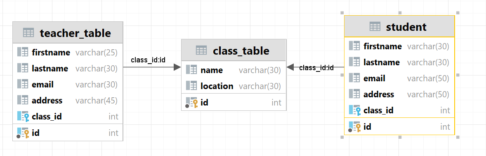
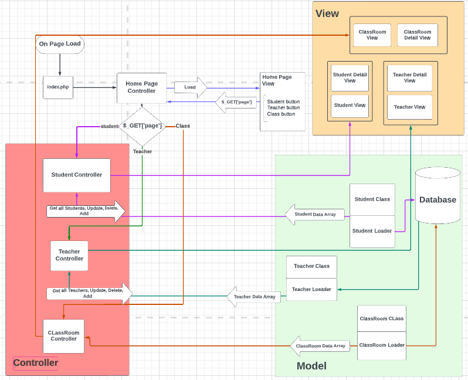

# php-crud
School management system with CRUD implementation with MVC

[ ] Create Database

[ ] Create a repository

[ ] Add Contributors to repository

[ ] Make a Database connection to local using .env file

[ ] Manage .gitignore

[ ] index.php

## Database Implementation 

## Project's flow chart

