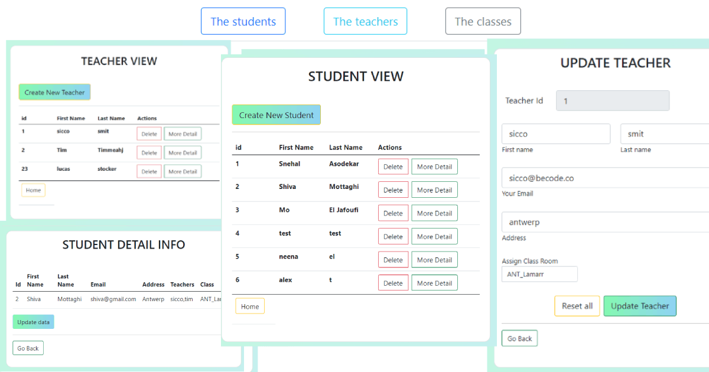

# php-crud
School management system with CRUD implementation with MVC.

# Group
[Shiva](https://github.com/shivamottaghi)

[Mo](https://github.com/Hub-Mo)

[Snehal](https://github.com/SnehalChetan)

# Roadmap
## Database design
* To develop a school management system decide how many table and fields for these tables require.
* teacher, classrooms (class) and students table needed
* below is the db strucure
### Database Implementation 

## MVC
* Create basic MVC strucure, in this we are going to use the one homepage controller which allow user to navigate to Student, Teacher and Class  views and their CRUD operations.
* Each student, teacher and class has below MVC strucure,
  * #### Model
      | Student           | Teacher            | Class           |
      |------------------|--------------------|-----------------|
      | Student.php       | Teacher.php        | Class.php       |
      | StudentLoader.php | TeacherLoader.php  | ClassLoader.php |
    * **Db Connection :** This model used to establish a **mysql** database connection using **PDO**.
    * **Student.php :** To crete new student with all fields as in database table. This Model has getter methods.
    * **StudentLoader.php :** These loader files extends database connection class. These has methods for CRUD operations and the other methods to get data from database.
  * #### View
    | Student             | Teacher             | Class              | Displays        |
    |---------------------|--------------------|-----------|-----------------|
      | student View        | teacher View        | classes View       | General info of all with delete and more detail tab   |
      | Add new student view | teacher Create View |                    | Create Form with reset button for insert query       |
      | student Detail View | teacher Detail View | Classes Detail View | Details page info. (Student displays all his info with **his class names and teacher names**) |
      | Edit student View  | teacher Update View |                    | Update form with reset button for update query |
      | Delete Student Successful View | not Added           |                    | Show successful delete message|
    * View has **Home page view** which is used to display the first load view of project, it has 3 tabs namely Studentm Teacher and Classes, User can navigate through these tabs.
  * #### Controller
    | Student            | Teacher            | Class      | 
    |------------------|---------------|-----------------|
    | Student Controller | Teacher Controller  | ClassRoom Controller|
    
    * There is a Home page Controller, through this index page call home page view. 
    * When user clicks on any tab from homepage it will redirect to the general information view page according to the user selection.
    * In this project we are using only **one controller for Student, Teacher and Class**. Using this single controller we manage all the operations and their respective views with **switch statement**.

## Challenges
* Create environment local file with database details by each team member and put it to .gitignore. ( To avoid errors, we create a Sample env file with variables names which we used to connect with database)
* Decide how to use a single controller for each section. So that we reduce the stack of number of controller files.
* While planning, it took time to decide the database structure, MVC structure implementation with understanding and flow.

## Project's flow chart

## Part of final Result
